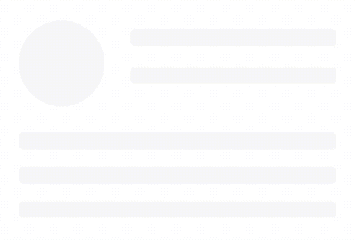
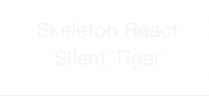
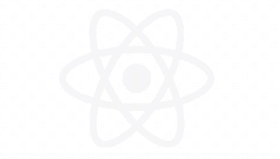
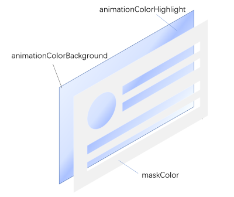

[中文版](./README.ZH_CN.MD)

For more instructions, please read [Instruction](docs/Instruction.md).

# Description

### skeleton-screen-react is a powerful and lightweight skeleton screen component based on React.



# Background

There are already some implementations of skeleton screens in the market, but they have some problems:

1. Elements in the skeleton screen cannot achieve continuous global animation.

   This is the most common problem. You will find that the elements displaying animation effects in the skeleton screen execute their own animation effects separately, which doesn't look elegant.

2. Only simple uniform color change effects can be displayed.

   In order to avoid exposing problem 1, some skeleton screen solutions choose to let all animation elements execute a uniform color or transparency change effect together, and cannot achieve the effect of color linear gradient flow.

3. Usage threshold

   To thoroughly solve the above two problems, some skeleton screen solutions choose to use SVG to implement, but this undoubtedly makes the usage threshold of the skeleton screen component higher.

skeleton-screen-react is born to solve these problems!

# Examples

skeleton-screen-react is very flexible to use. You can use simple code to implement a normal skeleton screen effect like this:


or use product names or other text as placeholders for the skeleton screen, like this:



even if necessary, you can use the SVG version of the product logo provided by the designer as the placeholder for the skeleton screen.



# How to use

### Getting start

First, add the dependency of skeleton-screen-react to your project:

```shell
yarn add skeleton-screen-react
```

or

```shell
npm i skeleton-screen-react
```

Next, import the skeleton component and its style file in your code:

```typescript
import { Skeleton } from "skeleton-screen-react";
import "skeleton-screen-react/dist/styles/skeleton.css";
```

Then, load the Skeleton component on the page and set the corresponding properties:

```typescript

<Skeleton
  maskColor='#fff'
  animationColorBackground='#fafafa'
  animationColorHighlight='#ebebeb'
  >
  {(color: string) => {
      // skeleton placeholder elements
      return (
         <div style={{ position: 'relative', width: '100%', height: '100%', textAlign: 'center', fontSize: '20px', color }}>
            skeleton-screen-react<br/>Silent Tiger
         </div>
      );
  }}
</Skeleton>
```

This way, you get a skeleton screen effect with the text "skeleton-screen-react Silent Tiger" as a placeholder.

### Configuration
|Property                  |Type                           |Required|Description|
|---                       |---                            |---     |---        |
|maskColor                 |string                         |Y       |Color of the mask part|
|animationColorBackground  |string                         |Y       |Background color in the animation effect|
|animationColorHighlight   |string                         |Y       |Highlight color in the animation effect|
|children                  |(color: string) => ReactElement|Y       |Function that returns skeleton screen animation elements|
|wrapperStyle              |CSSProperties                  |        |Custom style for the outer container of the skeleton screen component|
|backgroundStyle           |CSSProperties                  |        |Custom style for the background animation of the skeleton screen|
|isDarkMode                |boolean                        |        |Dark mode|
|className                 |string                         |        |Custom class name for the outer container of the skeleton screen component|

The implementation of skeleton-screen-react is similar to overlaying a mask with a user-defined structure on a background with gradient animation effects. The overall color effect of the skeleton screen can be basically determined by the three attributes of ```maskColor```, ```animationColorBackground``` and ```animationColorHighlight```, as shown in the following figure:



The ```children``` function defines the structure of the "mask". It should be noted that the ```children``` function receives a ```color``` parameter, which only needs to be assigned to the ```color``` attribute of the element that needs to be "hollowed out". If the hollowed-out area is a rectangular area, the color parameter can be assigned to the ```background-color``` style attribute of a div. If the part that needs to be hollowed out is text, the ```color``` parameter can be assigned to the ```color``` style attribute of the text, and so on.

Here, I want to especially mention the ```isDarkMode``` attribute. When the color specified by ```animationColorBackground``` is lighter than ```maskColor```, remember to mark ```isDarkMode``` as ```true```, otherwise you may see some jagged edges in the hollowed out area. This attribute can be very useful when your page is in dark mode.

You can try all these properties in this [Storybook](https://silenttiger.online/skeleton-screen-react/) page.

### Customized Development
skeleton-screen-react provides as much flexibility as possible for customization. If the default animation effects of skeleton-screen-react cannot meet your requirements, you can personalize the animation effects by using the ```backgroundStyle``` attribute. If the skeleton-screen-react component has special layout requirements on the page, you can also set them using the ```wrapperStyle``` attribute. Moreover, you can also modify the style of skeleton-screen-react or distinguish different types of Skeleton by using the ```className``` attribute over a larger scope.

In addition, you can perform more thorough and in-depth style customization development by overriding the CSS style files provided by skeleton-screen-react.

Have fun!

# License

MIT
