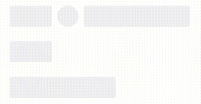
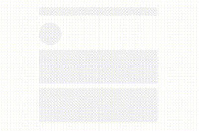
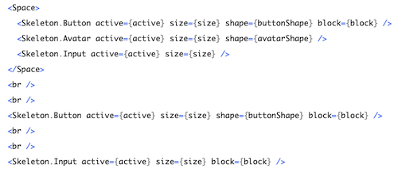
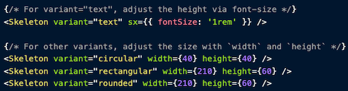
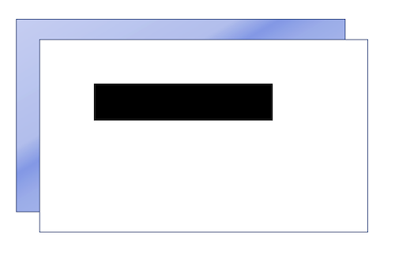
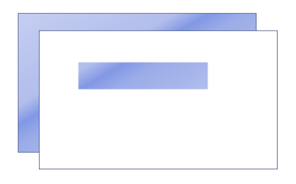
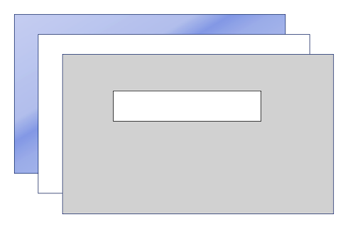
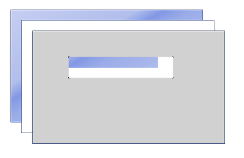
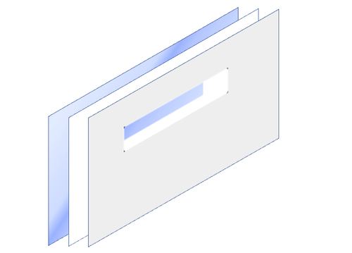

[English](./Instruction.md)

# 动机

最近遇到了一个实现骨架屏的需求，我大致调研了一下市面上使用得比较多的骨架屏方案，发现这些方案很多都不能满足我的需求，比如

 

或者

 

从第一幅图可以看到，骨架屏中的元素有着各自独立的动画效果，也就是说其中的“波浪”并不是从左边的元素跑到右边的元素，而是分别从每个元素的左边跑到每个元素的右边，这看起来多少有点不太优雅。

第二个例子为了避免图一中暴露的问题改用了整体色彩渐变的方式，通过去掉“波浪”效果使得元素的动画效果看起来是统一的，但这样显然让页面少了些“灵动”。

另外，这两个骨架屏组件在实现上都采用了类似的接口





可以看出，这样的接口设计，基本上决定了骨架屏中的元素只能是圆形或矩形，而且排版方式相对固定。同时动画效果也比较固定，只有渐变和“波浪”两种。

还有一种骨架屏方案是用 svg 的 clipPath 实现的，它基本上解决了上述的问题，但缺点是用起来有些门槛。很多前端同学其实并没有自己写过 svg，对 svg 技术的用法和特点也不太熟悉，所以这个方案的作者甚至专门实现了一个生成器工具，让用户通过 gui 界面来生成一套使用这个骨架屏组件的配置，可见使用门槛并不低。

那么有没有一种方法既能做到优雅的效果和灵活的配置接口，同时还方便使用能够快速上手呢？

# 方案

首先，一个 css 动画效果只能在单一 dom 节点上执行，所以要想实现“波浪”效果在元素之间流转，给每个元素单独设置动画效果是肯定行不通的。所以为了实现一个能在元素间流转的“波浪”，我们给骨架屏一个撑满的背景元素，并在背景元素上执行“波浪”动画效果，再通过某些方式实现一个带镂空窗口的蒙板。

要实现一个带镂空窗口的蒙板，最简单直观的方案，自然是用若干个不透明的元素把不需要镂空的位置遮挡起来，留出需要镂空的地方。

这样对于矩形镂空区域还比较好处理，如果要求镂空区域是圆形或其他复杂形状就难以实现了。而且从上图就能看出，这样的方案在具体实现时会非常麻烦，尤其是当骨架屏元素的尺寸需要根据外面环境相应变化的时候，这种方案的实现难度就会变得更高，代码也难以维护。

那么，如果实现一个简单又易于维护的蒙板呢？

到这里，就要引入我们本篇的重点了：[mix-blend-mode](https://developer.mozilla.org/en-US/docs/Web/CSS/mix-blend-mode)。

```mix-blend-mode``` 是用来控制图层色彩混合方式的，一共有 16 种模式，我们着重讲一下这其中的 ```darken``` 和 ```lighten``` 两种模式。这两种混色模式的逻辑可以参考[这个链接](https://en.wikipedia.org/wiki/Blend_modes)，可以看到这两种模式的算法其实都非常简单，darken 模式下混色时直接对两种颜色分别在 R、G、B 三个通道取较小值，相反 lighten 模式下则是对两种颜色分别在 R、G、B 三个通道取较大值。



那么考虑上图的场景，上层的图层外围是白色，中间的矩形是黑色。这时如果给这个图层设置 ```mix-blend-mode``` 为 ```lighten```，那么对于外围白色的区域由于白色在 R、G、B 三个通道都已经是最大值了，所以还是会保持白色。而中间黑色的矩形区域，由于黑色在 R、G、B 三个通道都已经是最小值了，所以就会变成下面图层的颜色。最终就是下面这样的效果：



到这里，我们就已经可以通过 ```mix-blend-mode``` 实现了一个简单的骨架屏效果了！

更进一步，如果要求骨架屏的非动画元素部分不是白色，该怎么办呢？可能你已经想到了，我们用 ```mix-blend-mode``` 再前面的基础上再取一次色。



如上图所示，我们再构建一个“蒙板”，这次我们把最上层的外围设置为需求要求的骨架屏外围颜色，把中间的矩形区域设置成白色，然后再给这个图层的 ```mix-blend-mode``` 设置为 ```darken```，这样外围区域因为下层的白色已经在 R、G、B 三个通道都已经是最大值了，所以用 ```darken``` 模式混色时就会取到最上层的颜色。而中间的矩形区域也因为同样的原因会渠道下层矩形区域的颜色。





由此，一个可以任意定义色彩范围的骨架屏组件就实现了。

# 总结
通过上面的示例，你应该可以发现，用 ```mix-blend-mode``` 来实现蒙板效果相比于文档开头提到的那几种方案，不仅功能上灵活多样，而且上手非常简单，前端开发人员只用写基本的 DOM 结构和样式就能快速得到自己想要的效果。

而且，基于 ```mix-blend-mode``` 的蒙板，还可以用在很多其他的场景，比如下面这个效果，选项的边框和选项内的金额字符的渐变效果是连续的，不使用蒙板的话只能让设计师直接出图来实现了，但这样在国际化、黑暗模式、多分辨率适配等场景下就会增加很多复杂度，而使用蒙版来实现就会变得非常简单。


能读到这里，想必你已经有所收获，如果你觉得 Skeleton Screen React 帮你节省了至少半小时时间，就捐赠我一杯豆浆吧(是的，我不怎么喝咖啡)，不胜感激 😁

 

[](https://hits.seeyoufarm.com)